## 251209

### [Objectives_ 학습 목표]
- CORS 정책을 이해하고 Django 서버에 허용 출처를 설정함
- Pinia action 내에서 Axios로 DFR API에 데이터를 요청함
- Piniastore의 데이터를 컴포넌트에서 렌더링할 수 있음
- RouterLink를 사용해 동적 경로의 상세 페이지로 이동함
- useRoute로 ID를 얻어 DRF로부터 단일 데이터를 조회함
- v-model을 사용해 게시글 생성을 위한 form을 작성함
- Axios POST 요청으로 DRF 서버에 새로운 데이터를 생성함

---
### [Build_ 이론]
### DRF 프로젝트 안내
- 스켈레톤 프로젝트 django-pjt 제공
- 외부 패키지 및 라이브러리는 requirements.txt에 작성되어 있음
  -> DRF 프로젝트는 제공된 스켈레톤 코드의 주석을 해제하며 진행

**Skeleton code 살펴보기**
- Model 클래스 확인
- URL 확인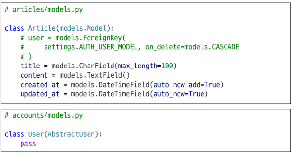
- Serializers 확인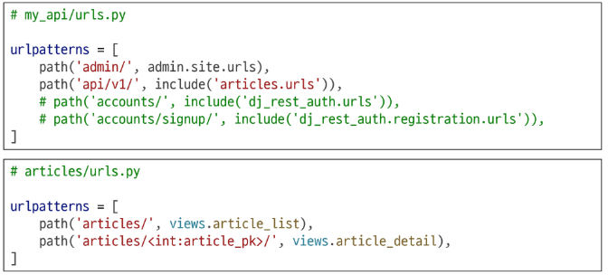
- views.py의 import 부분 확인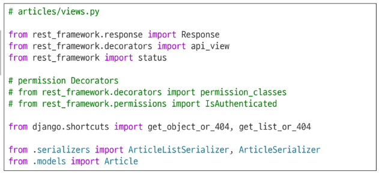
- View 함수 확인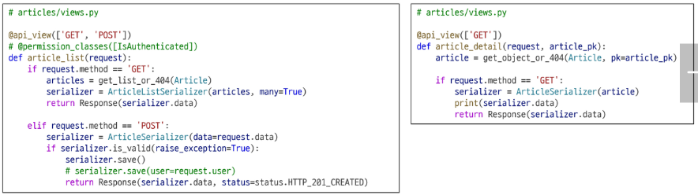
- settings.py 확인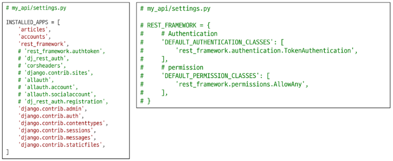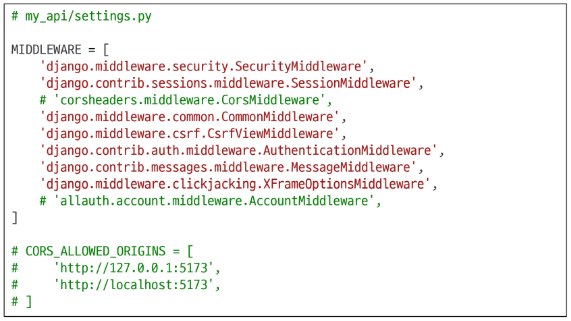
- Fixtures 확인 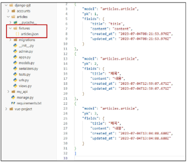
- 가상 환경 생성 및 활성화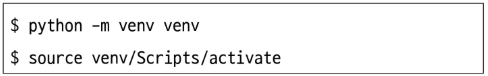
- 패키지 설치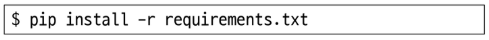
- Migration 진행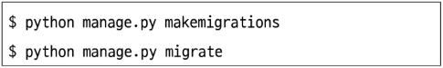
- Fixtures 데이터 로드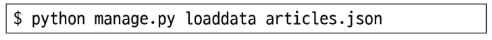
- Django 서버 실행 후 전체 게시글 조회 요청하기(http://127.0.0.1:8000/api/v1/articles/)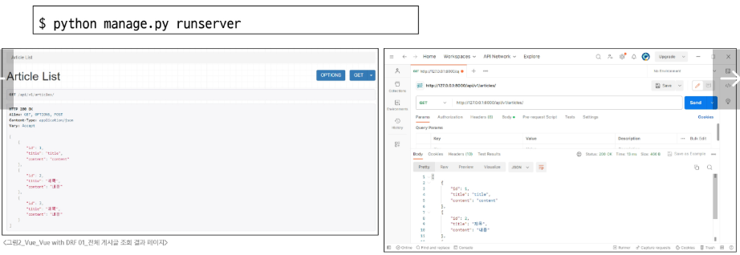

### Vue 프로젝트 안내
- 스켈레톤 프로젝트 vue-pjt 제공
- Vite를 사용해 Pinia 및 Vue Router가 추가되어 있음
- pinia-plugin-persistedstate가 설치 및 등록되어 있음
- Vue 프로젝트는 제공된 스켈레톤 코드 위에 "직접 코드를 작성"하며 진행함
- Vue 컴포넌트와 프로젝트 구조 확인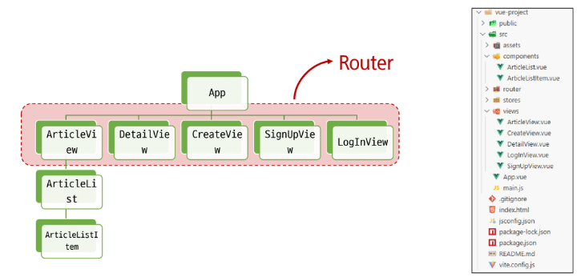

**Skeleton code 살펴보기**
- App 컴포넌트 확인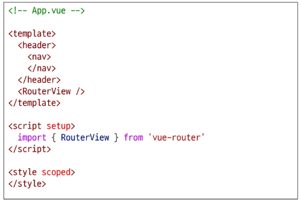
- route에 등록된 컴포넌트(Article, Create, Detail, LogIn, SignUp)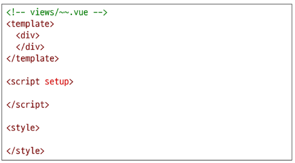
- ArticleList 컴포넌트
- ArticleListItem 컴포넌트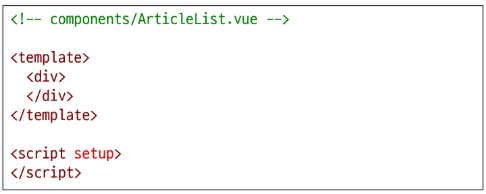
- router/index.js 확인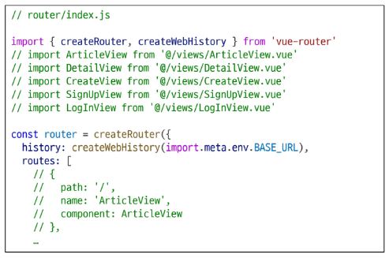
- store 확인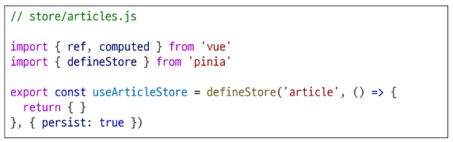
- main.js 현황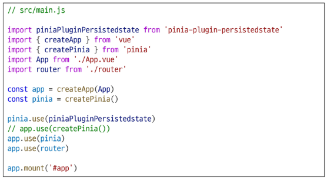
- 패키지 설치 및 서버 실행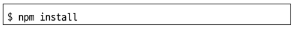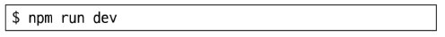

### 메인 페이지 구현
**게시글 목록 출력**
- 게시글을 출력하는 컴포넌트를 연결하는 ArticleView의 route 관련 코드 주석 해제하기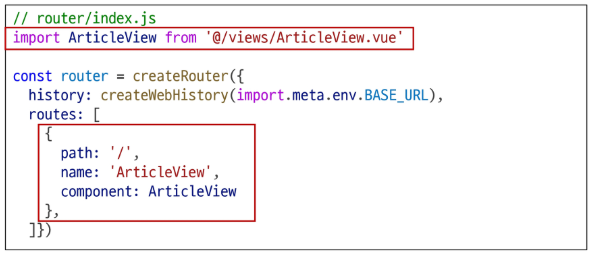
- App 컴포넌트에 ArticleView 컴포넌트로 이동하는 RouterLink 작성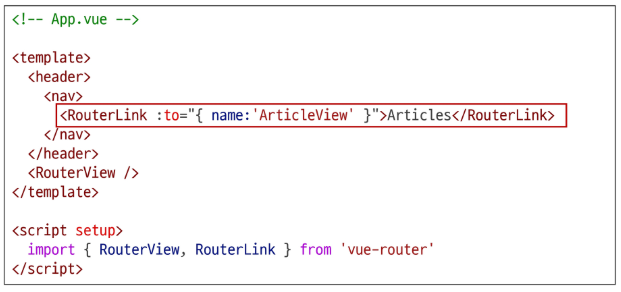
- 게시글 목록을 담당하는 ArticleList 컴포넌트를 ArticleView 컴포넌트에 등록하기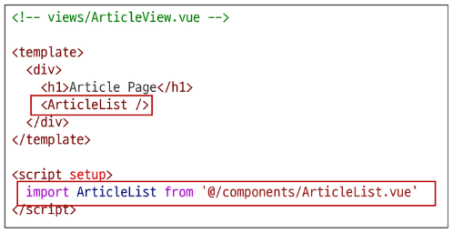
- store에 임시 데이터 articles 배열 작성하기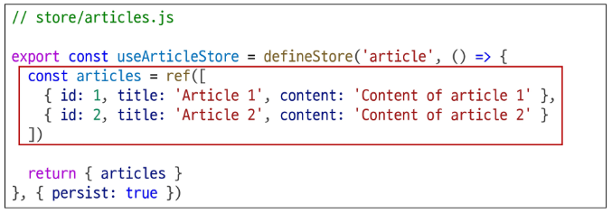
- ArticleList 컴포넌트에서 게시글 목록 출력
- store의 articles 데이터 참조
- v-for를 활용하여 하위 컴포넌트에서 사용할 article 단일 객체 정보를 props로 전달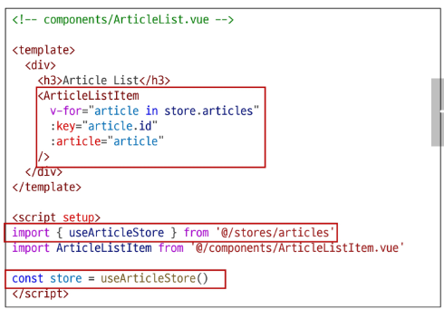
- ArticleListItem 컴포넌트는 내려 받은 props를 정의
- 메인 페이지에서 게시글 목록 출력 확인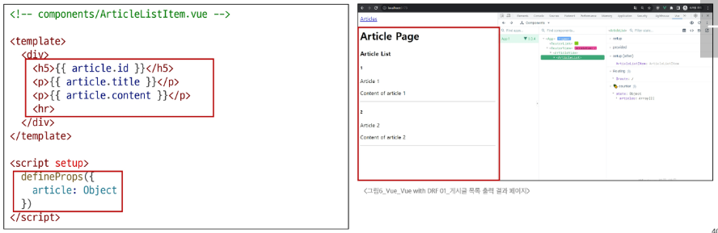

### DRF와의 요청과 응답
**DRF로부터 응답 데이터 받기**
- 이전에 임시 데이터를 작성했던 부분을 DRF 서버에 요청하고, 데이터를 응답 받아 store에 저장 후 출력하기

**DRF와의 요청과 응답**
- DRF 서버로의 AJAX 요청을 위한 axios 설치 및 관련 코드 작성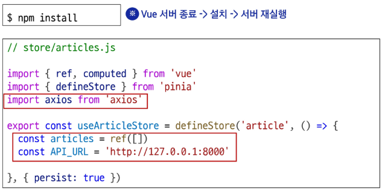
- DRF 서버로 요청을 보내고 응답 데이터를 처리하는 getARticles 함수 작성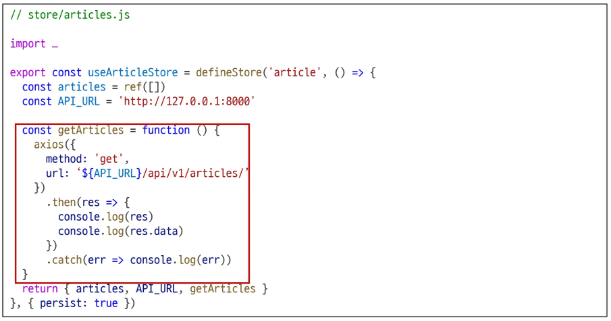
- ArticleView 컴포넌트가 마운트될 때 getArticles 함수가 실행되도록 함
-> 해당 컴포넌트가 렌더링될 때 항상 최신 게시글 목록을 불러오기 위함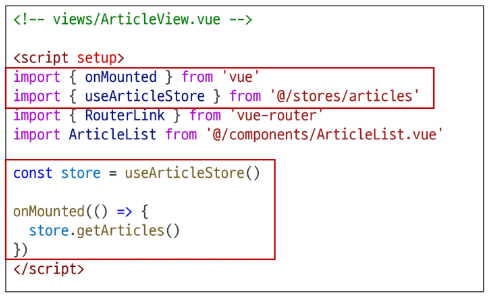
- Vue와 DRF 서버를 모두 실행한 후 응답 데이터 확인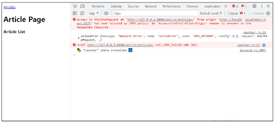 -> 에러 발생
- DRF 서버 측에서는 문제없이 응답했음(200 OK) -> 서버는 응답했으니 브라우저 측에서 거절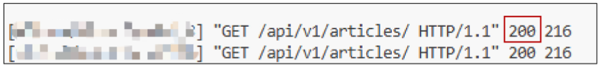
- 브라우저가 거절한 이유
  -> 'localhost:5173'에서 '127.0.0.1:8000/api/v1/articles/'의 XMLHttpRequest에 대한 접근이 CORS policy에 의해 차단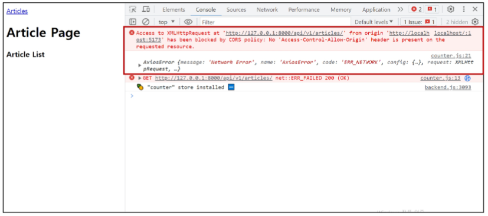

### CORS Policy
**웹 브라우저의 동일 출처 정책과 보안**
- 기본적으로 웹 브라우저는 같은 출처에서만 요청하는 것을 허용
- store에 게시글 목록 데이터 저장 후 store에 저장된 게시글 목록 출력 확인
  - pinia-plugin-persistedstate에 의해 브라우저 Local Storage에 저장됨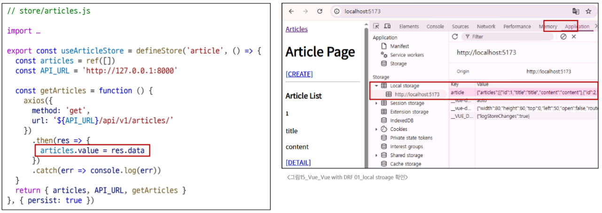

### 단일 게시글 조회
- DetailVue 관련 route 주석 해제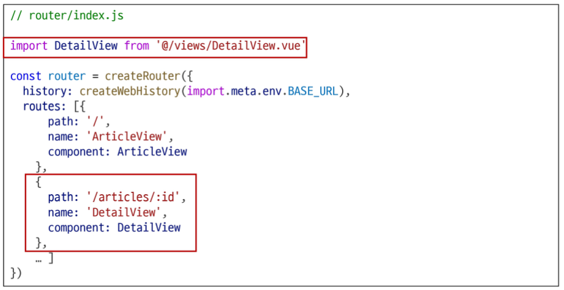
- ArticleListItem에 DetailView 컴포넌트로 가기 위한 RouterLink 작성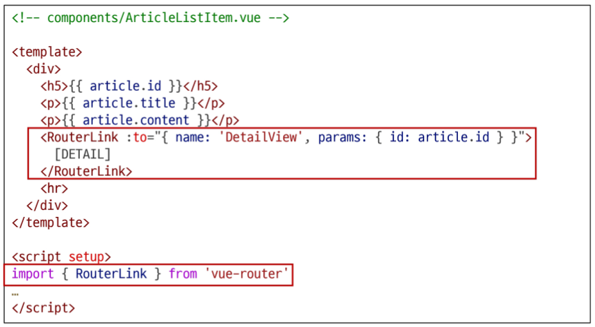
- DetailView가 마운트될 때, 특정 게시글을 조회하는 AJAX 요청을 보낸 후 응답 데이터 확인
  - http://localhost:5173/articles/1/
  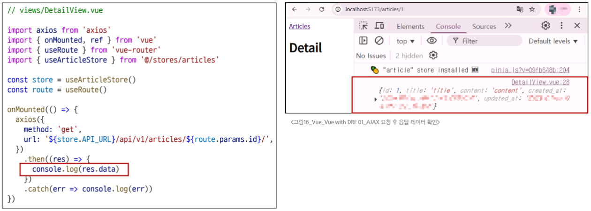
- 응답 데이터 저장 후 출력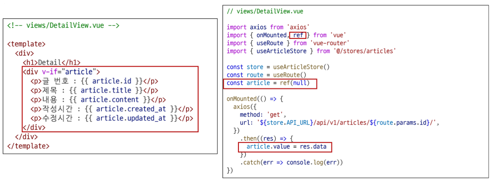
- 결과 확인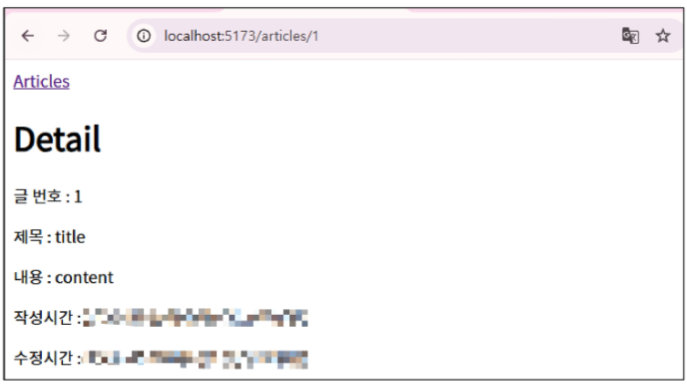

### 게시글 작성
- CreateView 관련 route 주석 해제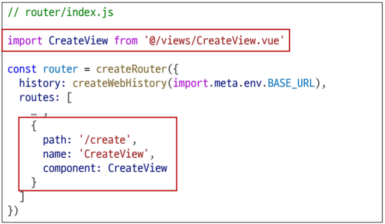
- ArticleView에 CreateView 컴포넌트로 가기 위한 RouterLink 작성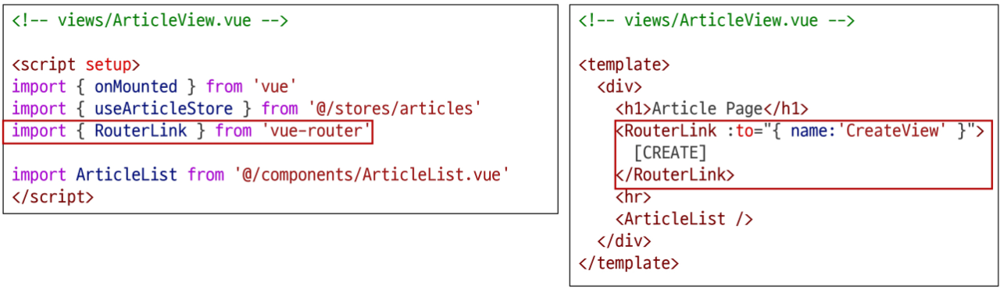
- v-model을 이용해 사용자 입력 데이터를 양방향 바인딩
- v-model의 trim 수식어를 사용해 사용자 입력 데이터의 공백을 제거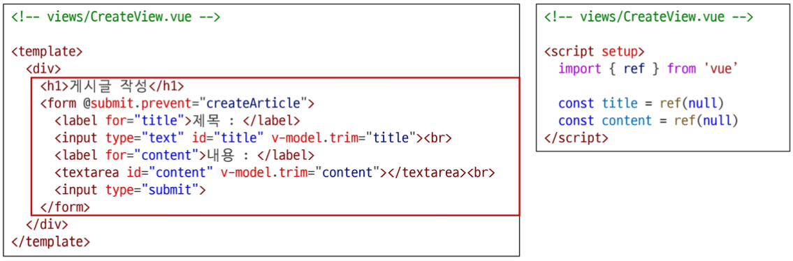
- 양방향 바인딩 데이터 입력 확인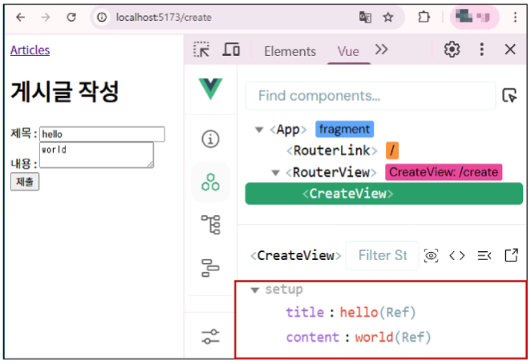
- 게시글 생성 요청을 담당하는 createArticle 함수 작성
- 게시글 생성이 성공하면, ArticleView 컴포넌트로 이동시킴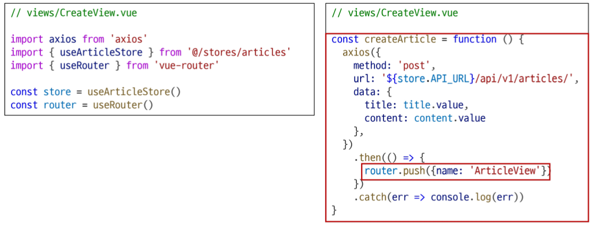
- submit 이벤트가 발생하면 createArticle 함수를 호출
- v-on의 prevent 수식어를 사용해 submit 이벤트의 기본 동작 취소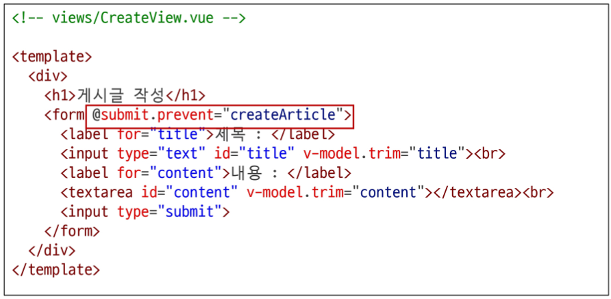
- 게시글 생성 결과 및 DB 확인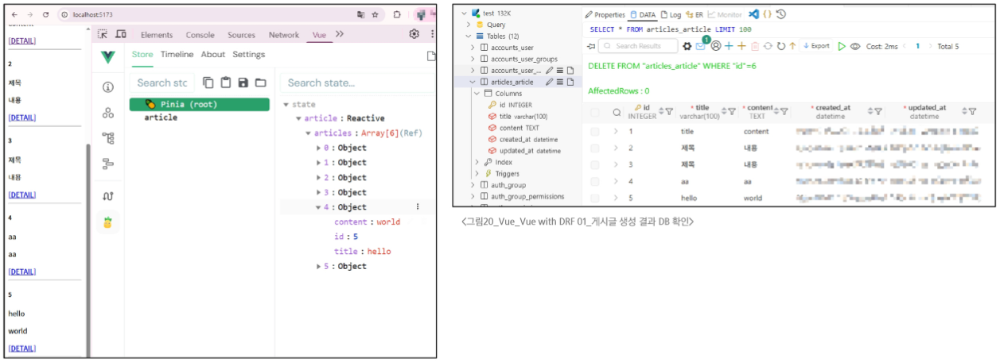
---
### [Review_ 활동 정리]
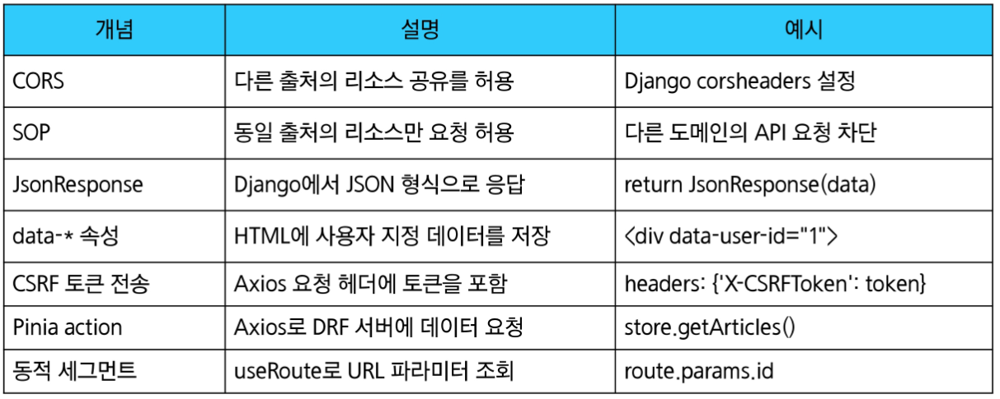
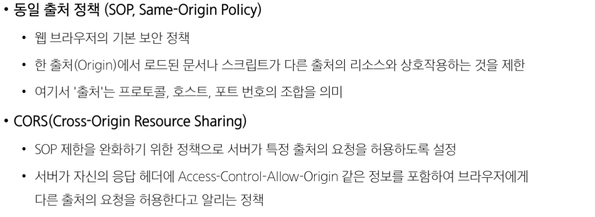
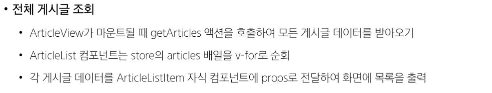
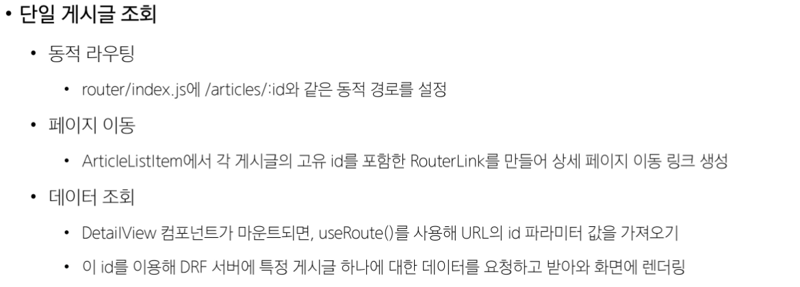
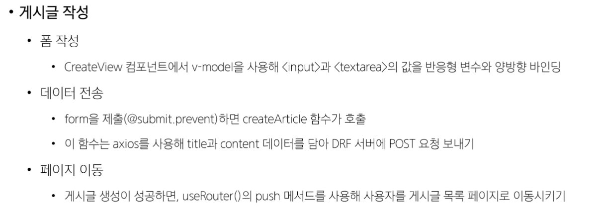
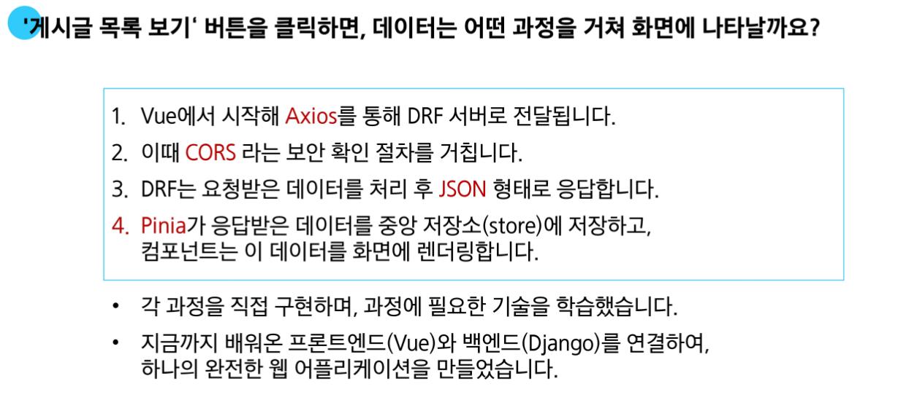