## 251210

### [Objectives_ 학습 목표]
- DRF의 토큰 기반 인증 시스템의 동작 방식을 이해함
- dj-rest-auth를 사용하여 인증 관련 API 엔드포인트를 구성함
- 로그인 API 요청을 통해 DRF로부터 인증 토큰을 발급받음
- 발급받은 토큰을 Authorization 헤더에 담아 요청을 보냄
- DRF의 권한(Permission) 개념과 401,403 에러를 이해함
- @permission_classes로 특정 view에 대한 접근 권한을 설정함
- 게시글 등 데이터를 생성할 때 현재 인증된 사용자와 연결함
---

### [Build_ 이론]
### 인증 with DRF
**사전 준비**
- 인증 로직 진행을 위해 User 모델 관련 코드 활성화
- user ForeignKey 주석 해제
- serializers의 read_only_fields 주석 해제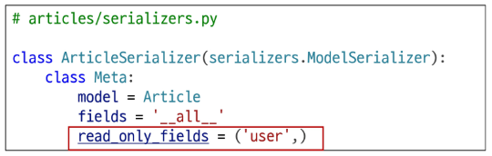
- article_list view 함수에서 게시글 생성 시 user 정보도 저장될 수 있도록 주석 해제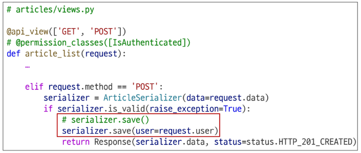
- DB 초기화
  - db.sqlite3 삭제
  - migrations 파일 삭제
- Migration 과정 재진행
- fixtures의 articles.json은 user 정보가 없으므로 loaddata 불가능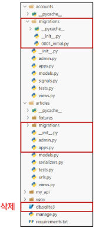

### 인증
**[복습] 인증의 필요성**
- 클라이언트와 서버 간의 상태 정보를 유지하기 위해서 쿠키와 세션을 사용
- 하지만 클라이언트와 서버는 사용자를 식별하지 못하고 있는 상태
- 그래서 사용자를 식별하기 위해서 필요한 과정이 바로 '인증(Authentication)'
- 다양한 인증이 존재함
  - 아이디와 비밀번호
  - 소셜 로그인(OAuth)
  - 생체인증
- Django에서는 사용자 인증과 관련된 가장 중요하고 기본적인 뼈대를 제공함(Django Authentication System)

**DRF에서의 인증**
- 인증은 항상 view 함수 시작 시 다른 코드의 진행이 허용되기 전에 실행됨
  - 수신 요청을 해당 요청의 사용자 또는 해당 요청이 서명된 토큰(token)과 같은 자격 증명 자료와 연결
- 이후 인증이 완료된 해당 자격 증명을 사용하여 권한 및 제한 정책을 확인하고 요청을 허용해야 하는 지를 결정
- 인증 자체로는 들어오는 요청을 허용하거나 거부할 수 없으며, 단순히 요청에 사용된 자격 증명만 식별함

**승인되지 않은 응답 및 금지된 응답**
- 인증되지 않은 요청이 권한을 거부하는 경우 해당되는 두 가지 오류 코드를 응답
1. HTTP 401 Unauthorized

    : "요청에 유효한 인증 자격 증명(Authentication Credentials)이 없어 사용자를 식별할 수 없음"을 의미(누구인지를 증명할 자료가 없음)
2. HTTP 403 Forbidden(Permission Denied)

    : 서버에 요청이 전달되었지만, 권한 때문에 거절되었다는 것을 의미

    : 401과 다른 점은 서버는 클라이언트가 누구인지 알고 있음

### 인증 정책 설정
1. 전역 설정
    - 프로젝트 전체에 적용되는 기본 인증 방식을 정의
    - DEFAULT_AUTHENTICATIONS_CLASSES를 사용
    - 기본 값: SessionAuthentication과 BasicAuthentication
    - 사용 예시(DRF 공식 문서 참고)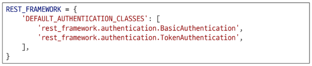
2. View 함수 별 설정
    - authentication_classes 데코레이터를 사용
    - 개별 view에 지정하여 재정의
    - 사용 예시(DRF 공식 문서 참고)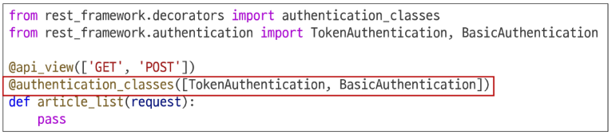

**DRF가 제공하는 인증 체계**
1. BasicAuthentication

    : 요청마다 사용자 이름과 비밀번호를 Base64로 인코딩하여 Authorization 헤더에 담아 보내는 방식
2. TokenAuthentication :white_check_mark:

    : 로그인 시 발급받은 고유한 토큰(Token)을 Authorization 헤더에 담아 요청함으로써 사용자를 인증하는 방식
3. SessionAuthentication

    : 장고의 기본 세션 시스템을 활용하여, 브라우저가 보내는 sessionid 쿠키를 통해 사용자를 인증하는 방식
4. RemoteUserAuthentication

    : 웹 서버 등 외부 시스템이 이미 처리한 인증 결과를 신뢰하고, 전달받은 사용자 이름으로 사용자를 인증하는 방식

**TokenAuthentication**
- token 기반 HTTP 인증 체계
- 로그인 시 발급받은 고유한 토큰을 Authorization 헤더에 담아 요청함으로써 사용자를 인증하는 방식
- 기본 데스크톱 및 모바일 클라이언트와 같은 클라이언트-서버 설정에 적합
- 서버가 인증된 사용자에게 토큰을 발급하고 사용자는 매 요청마다 발급받은 토큰을 요청과 함께 보내 인증 과정을 거침

### Token 인증 설정
- 인증 클래스 설정
  - TokenAuthentication 활성화 코드 주석 해제
-> 전역 인증 정책을 Token 방식으로 설정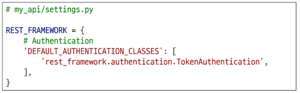
- INSTALLED_APPS 추가
  - rest_framework.authtoken 주석 해제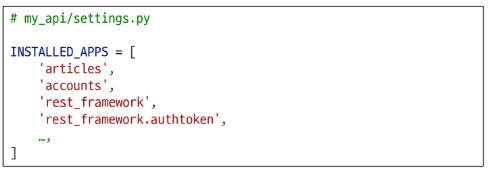
- Migrate 진행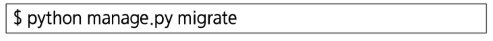

**토큰 인증 방식 과정 정리**
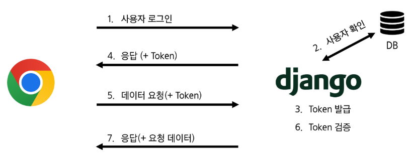

### Dj-Rest-Auth 라이브러리
**Dj-Rest-Auth**
- 화원가입, 로그인/로그아웃, 비밀번호 재설정, 소셜 로그인 등 다양한 인증 관련 기능을 API 엔드포인트로 제공하는 라이브러리
- dj-rest-auth는 django.contrib.auth를 대체하는 것이 아니라, 그 위에 만들어져 기능을 확장
- 인증 기능을 RESTful API로 제공

**Dj-Rest-Auth 설치 및 적용**
- 설치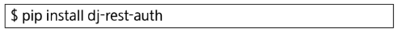
- 추가 App 주석 해제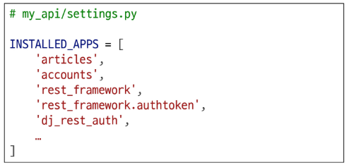
- 추가 URL 주석 해제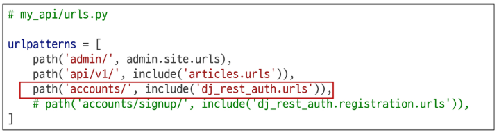

**Dj-Rest-Auth의 Registration(등록) 기능 추가 설정**
- 이전에 설치한 dj-rest-auth는 API 인터페이스를 제공하는 역할을 담당하며, 실제 로직 실행을 담당할 라이브러리를 추가로 설치
- 패키지 추가 설치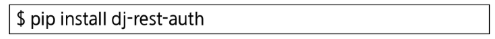
- 추가 App 주석 해제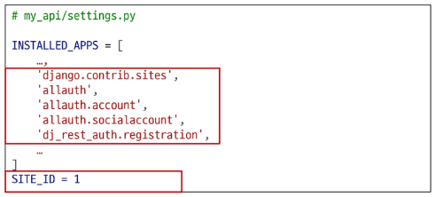
  - SITE_ID
    - 사이트의 주소 정보를 찾는 데 사용하며, DB의 Site 테이블에서 설정한 ID 값에 매치되는 주소를 사용
    - INSTALLED_APPS 목록의 'Django.contrib.sites'가 django_site 테이블을 자동으로 생성
- 관련 설정 코드 주석 해제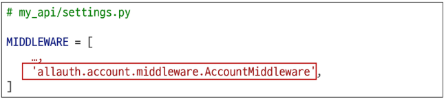
- 추가 URL 주석 해제 후 Migrate 진행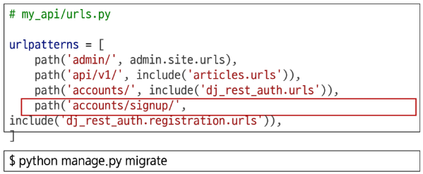

### Token 발급 및 활용
**Token 발급**
- 회원 가입 및 로그인을 진행하는 토큰 발급 테스트하기
- 라이브러리 설치로 인해 추가된 URL 목록 확인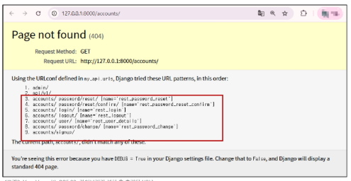
- 회원 가입 진행(DRF 페이지 하단 회원 가입 form 사용)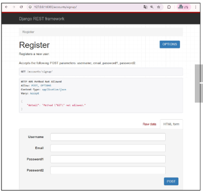
- 로그인 진행(DRF 페이지 하단 로그인 form 사용)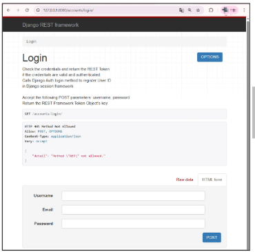
- 로그인 성공 후 DRF로 부터 발급 받은 Token 확인
-> 이 Token을 Vue에서 별도로 저장하여 매 요청마다 함께 보내야 함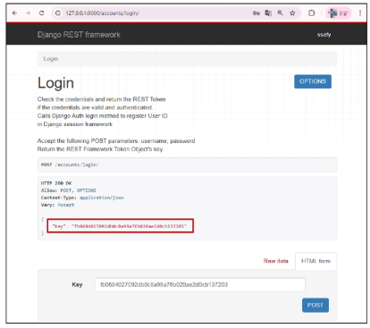

**Token 활용**
- 게시글 작성 과정을 통해 Token 사용 방법 익히기
- Postman을 활용해 게시글 작성 요청하기
  - http://127.0.0.1:8000/api/v1/articles/
  - Body에 게시글 제목과 내용 입력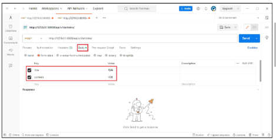
- Headers에 발급받은 Token 작성 후 요청 성공 확인
  - Key: "Authorization"
  - Value: "Token 토큰 값"
  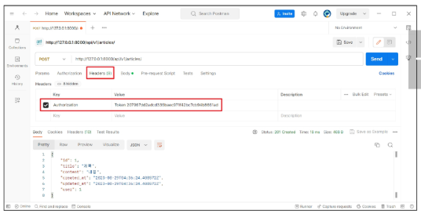

**클라이언트가 Token으로 인증 받는 방법**
1. "Authorization" HTTP Header에 포함
2. 키 앞에는 문자열 "Token"이 와야 하며 "공백"으로 두 문자열을 구분해야 함

**Token 데이터 확인**
- Django DB 확인
- 발급 받은 Token을 인증이 필요한 요청마다 함께 보내야 함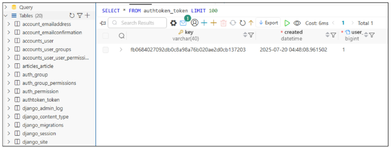

### 권한 with DRF
### 권한 정책 설정
- 전역 설정
  - 프로젝트 전체에 적용되는 기본 권한 방식을 정의
  - DEFAULT_PERMISSION_CLASSES를 사용
  - 기본 값: rest_framework.permissions.AllowAny
  - 사용 예시(DRF 공식 문서 참고)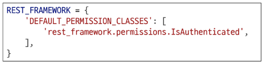
- View 함수 별 설정
  - permission_classes 데코레이터를 사용
  - 개별 view에 지정하여 재정의
  - 사용 예시(DRF 공식 문서 참고)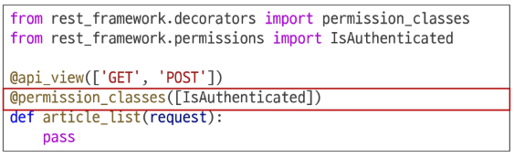

**DRF가 제공하는 권한 정책**
1. IsAuthenticated
    
    : 인증된(로그인한) 사용자만 접근을 허용하는 권한 클래스
    
    : 인증되지 않은 사용자의 모든 요청을 거부
    
    : request.user가 존재하고 인증된 상태인지 확인

    :보호해야 할 중요한 데이터나 리소스에 적합(ex : 회원 전용 페이지, 프로필 수정 등)
2. IsAdminUser

    : 스태프 권한(is_staff = True)을 가진 관리자 사용자만 접근을 허용하는 권한 클래스

    : 일반 사용자와 비인증 사용자의 모든 요청을 거부

    : reqeust.user.is_staff 속성 값이 True인지 확인하여 권한을 검사

    : 회원 목록 조회, 데이터 통계 등 사이트 관리자에게만 노출되어야 하는 민감한 API에 적합
3. IsAuthenticatedOrReadOnly

    : 인증된 사용자는 모든 요청(읽기/쓰기)을 허용하고, 비인증 사용자는 읽기 전용 요청만 허용하는 권한 클래스

    : 요청 메서드가 GET, HEAD, OPTIONS와 같은 안전한 메서드일 경우 무조건 허용하고, 그 외 메서드(POST, PUT 등)는 사용자의 인증 여부를 확인

    : 게시글 목록처럼 누구나 볼 수 있지만, 글 작성이나 수정은 회원만 가능한 API에 주로 적용
4. AllowAny

    : 아무런 제한 없이 모든 사용자의 접근을 허용하는 권한 클래스

    : 인증된 사용자든, 인증되지 않은 사용자든 상관없이 모두에게 접근을 허용

    : 권한 검사(Authorization) 로직을 전혀 수행하지 않음

    : API 엔드포인트를 완전히 공개하고 싶을 때 사용

    : 보안이 필요한 리소스에는 부적합하므로, 회원가입, 로그인 또는 공개 게시글 조회 등 공개 API에 주로 적용

### IsAuthenticated 설정
**IsAuthenticated 권한 설정**
- DEFAULT_PERMISSION_CLASSES 주석 해제
- 기본적으로 모든 View 함수에 대한 접근을 허용(AllowAny)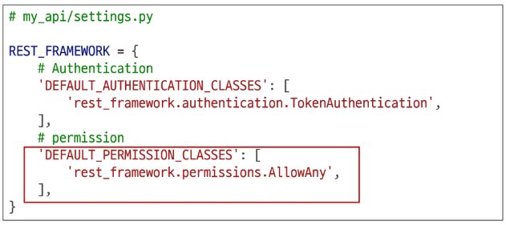

**권한 활용하기**
- 만약 관리자만 전체 게시글 조회가 가능한 권한이 설정되었을 때, 인증된 일반 사용자가 조회 요청을 할 경우 어떻게 응답되는지 확인하기
- 테스트를 위해 임시로 관리자 관련 권한 클래스 IsAdminUser로 변경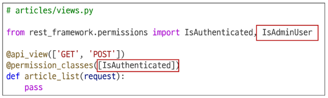
- 전체 게시글 조회 요청
  - http://127.0.0.1:8000/api/v1/articles/
- 403 Forbidden / 401 Unauthorized(Token 비활성화 후) 응답 확인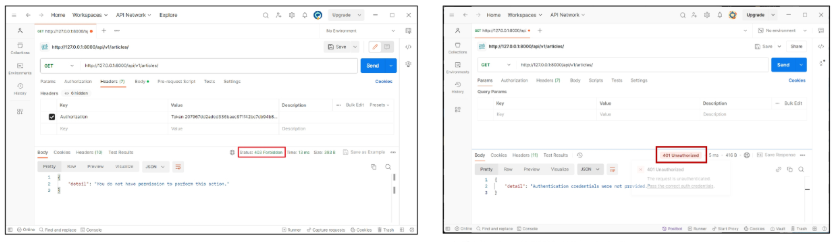
- IsAdminUser 삭제 후 IsAuthenticated 권한으로 복구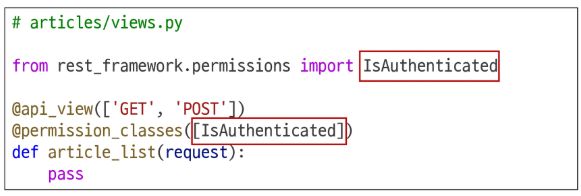
- 정상 작동하던 게시글 전체 조회가 작동하지 않음
  - 401 status code 확인
- 게시글 조회 요청 시 인증에 필요한 수단(token)을 보내지 않고 있으므로 게시글 조회가 불가능해진 것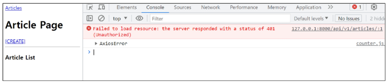

---
### [Review_ 활동 정리]
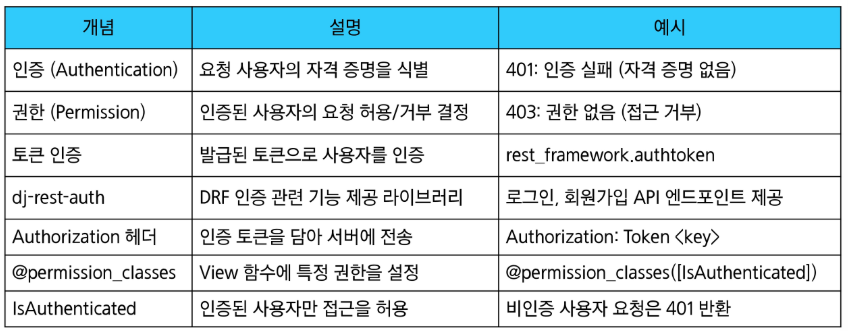
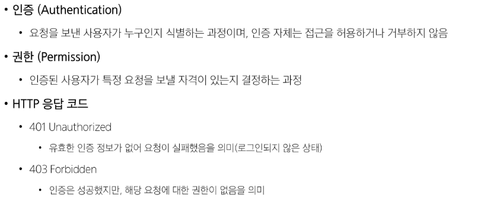
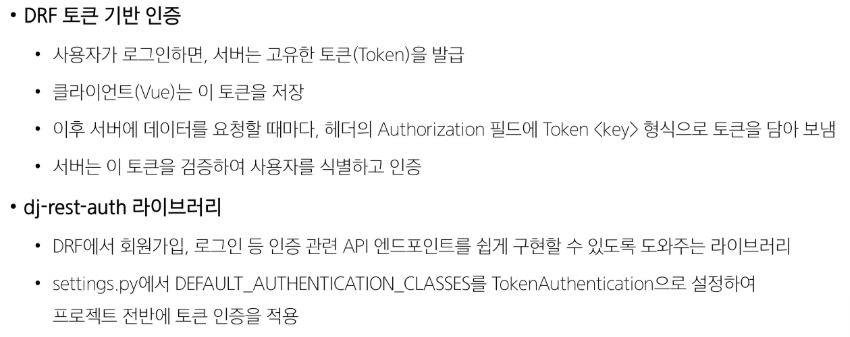
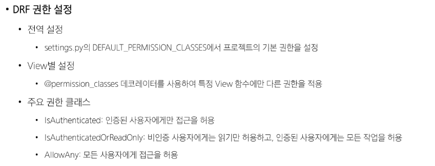
